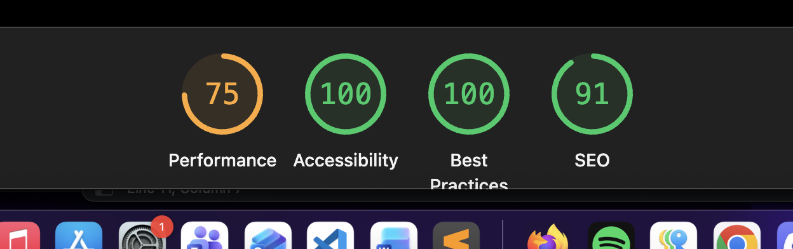
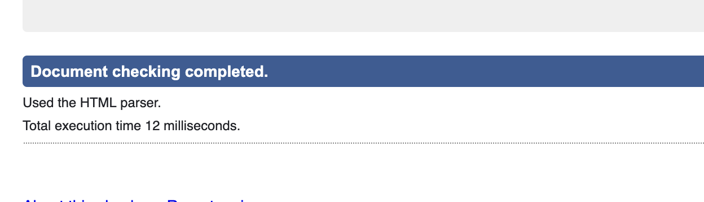

# Inlämningsuppgift: Webbshop

Detta projekt är en responsiv webbshop utvecklad som en del av kursen **JavaScript & Agila metoder** på Medieinstitutet.

Syftet med projektet var att bygga en interaktiv webbshop där användaren kan utforska produkter, filtrera och sortera sortimentet, lägga produkter i en varukorg och genomföra en beställning.

## Funktioner

- Produktlista med namn, pris, rating och kategori
- Minst 10 produkter och 3 produktkategorier
- Filtrering efter kategori
- Sortering efter namn, pris, kategori och rating
- Möjlighet att öka och minska antal produkter
- Varukorg med sammanställning av valda produkter
- Automatisk uppdatering av totalsumman
- Rabatter, avgifter och leveransregler
- Validering av kund- och betalningsuppgifter
- Kort- och fakturabetalning
- Rabattkod
- Möjlighet att rensa hela beställningen
- Responsiv design för mobil, tablet och desktop
- Tangentbordsnavigation och fokus på tillgänglighet
- Visuell feedback när varukorgens totalsumma ändras

## Använda tekniker

## Live-version

[Visa webbshoppen](https://isabelletherese.github.io/fed25d-inl-webbshop/)

## Tillgänglighet

### Lighthouse – mobil

### Lighthouse – desktop

### W3C HTML Validator

